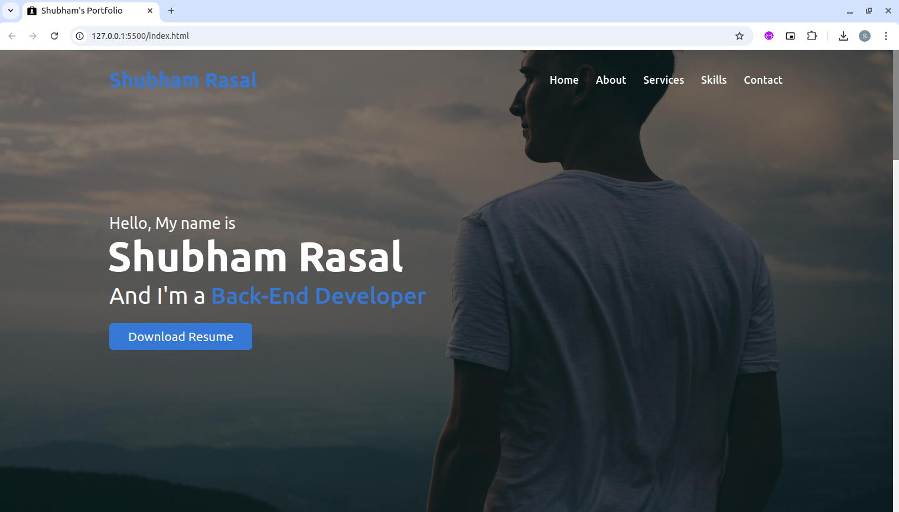
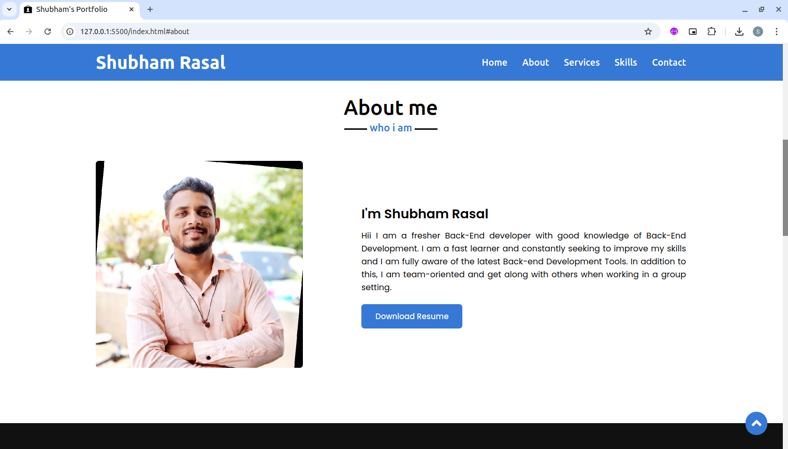
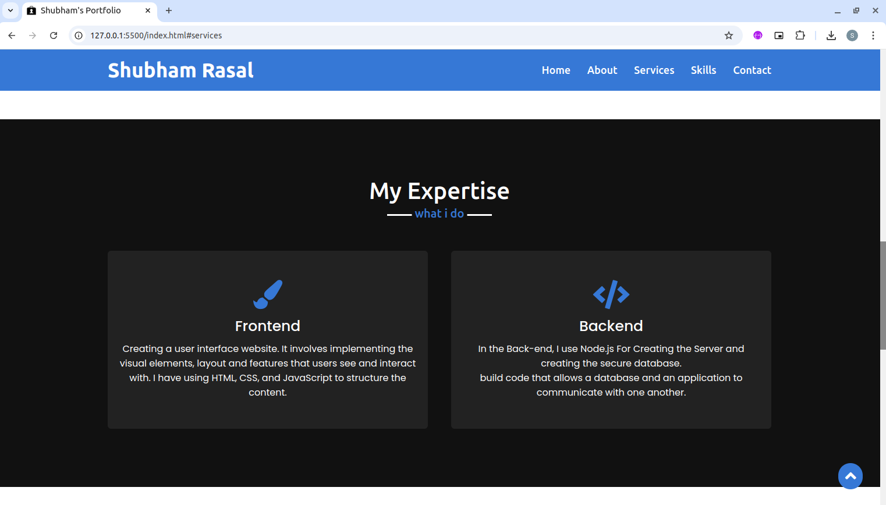
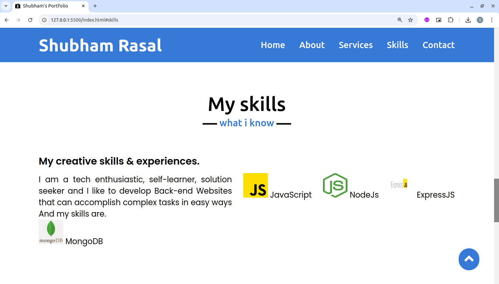
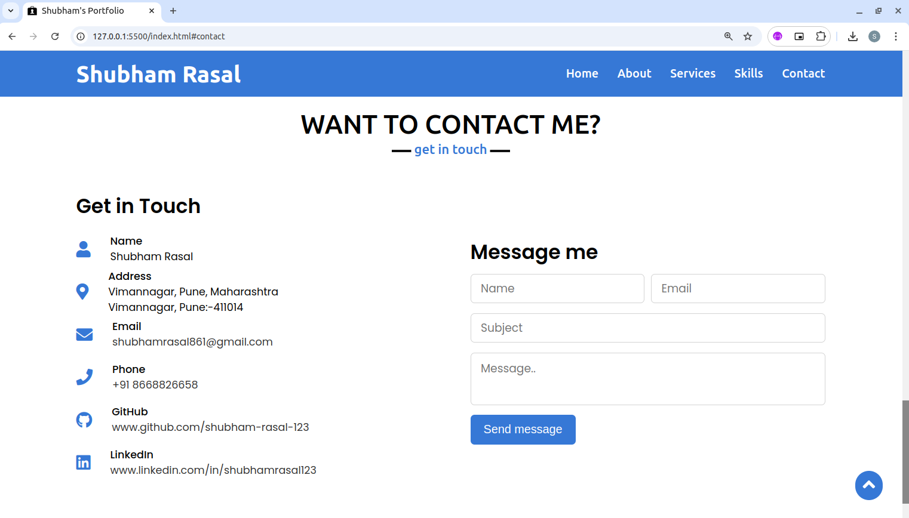

# Portfolio Website

## Screenshots

This project is a Portfolio Website built with [HTML](https://developer.mozilla.org/en-US/docs/Web/HTML), [CSS](https://developer.mozilla.org/en-US/docs/Web/CSS), and [JavaScript](https://developer.mozilla.org/en-US/docs/Web/JavaScript) to highlight personal or professional achievements, skills, and projects. The site features a clean and responsive design, ensuring an optimal viewing experience on any device. Interactive elements like smooth scrolling, animated transitions, and dynamic galleries enhance user engagement. The portfolio includes key sections such as "About Me," "Projects," "Skills," and "Contact," making it an excellent tool for showcasing expertise and creativity while practicing front-end development skills.

## Using launguage

+ `HTML`
+ `CSS`
+ `JavaScript`
+ `Formcarry` - [Formcarry](https://formcarry.com/)