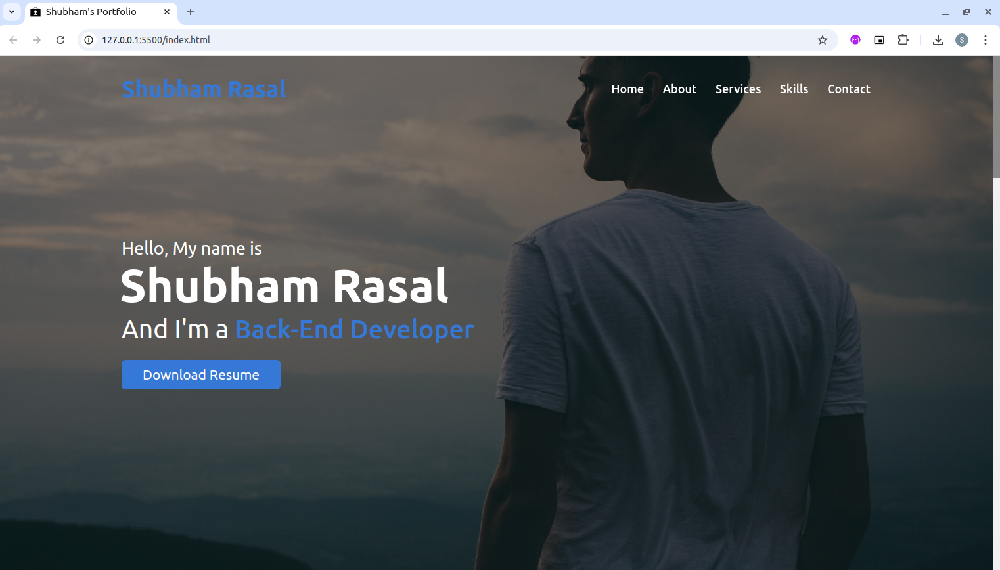
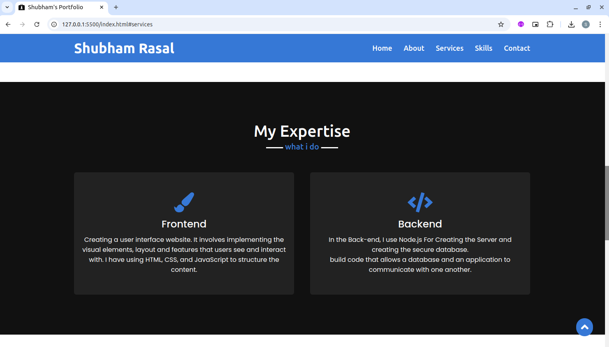
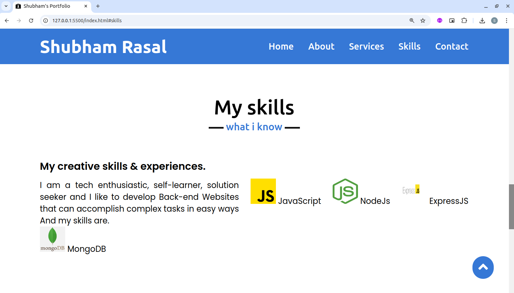

# Shubham Rasal | Portfolio Website


A modern and responsive personal portfolio website built with HTML, CSS, and JavaScript. It highlights the developer's background, services, technical skills, and contact information in a polished and user-friendly layout.

## ✨ Features

- Responsive layout for mobile, tablet, and desktop screens
- Clean personal branding and portfolio sections
- About, Services, Skills, and Contact areas
- Smooth scrolling and interactive UI elements
- Contact form integration with Formcarry

## 📸 Screenshots







## 🛠️ Tech Stack

- [HTML](https://developer.mozilla.org/en-US/docs/Web/HTML)
- [CSS](https://developer.mozilla.org/en-US/docs/Web/CSS)
- [JavaScript](https://developer.mozilla.org/en-US/docs/Web/JavaScript)
- [Formcarry](https://formcarry.com/)

## 📁 Project Structure

```text
.
├── index.html
├── style.css
├── script.js
└── images/
```

## ▶️ Run Locally

1. Clone the repository.
2. Open `index.html` in your browser.
3. If needed, run a simple local server from the project folder.

## 📬 Contact

- Email: <mailto:shubhamrasal861@gmail.com>
- GitHub: [shubham-rasal-123](https://github.com/shubham-rasal-123)
- LinkedIn: [Profile](https://www.linkedin.com/)

## 📝 License

This project is open for personal and educational use.
